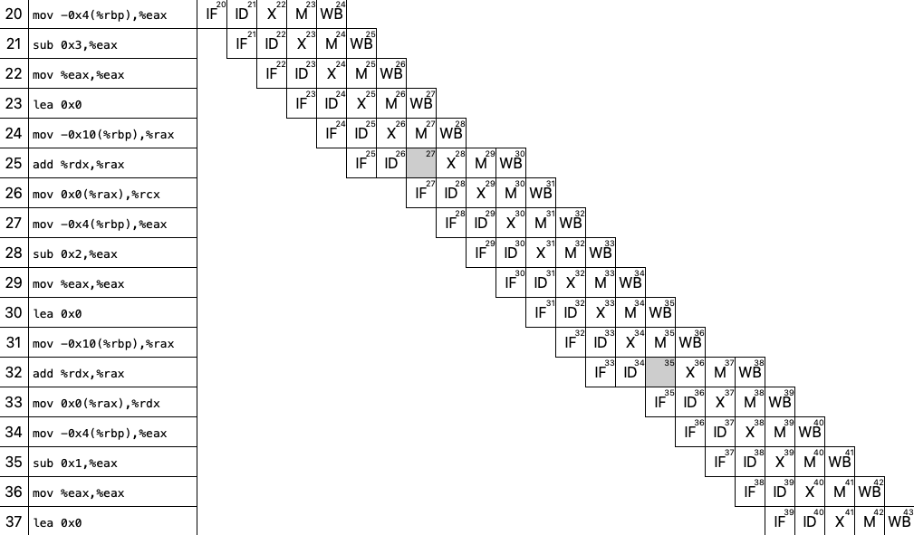
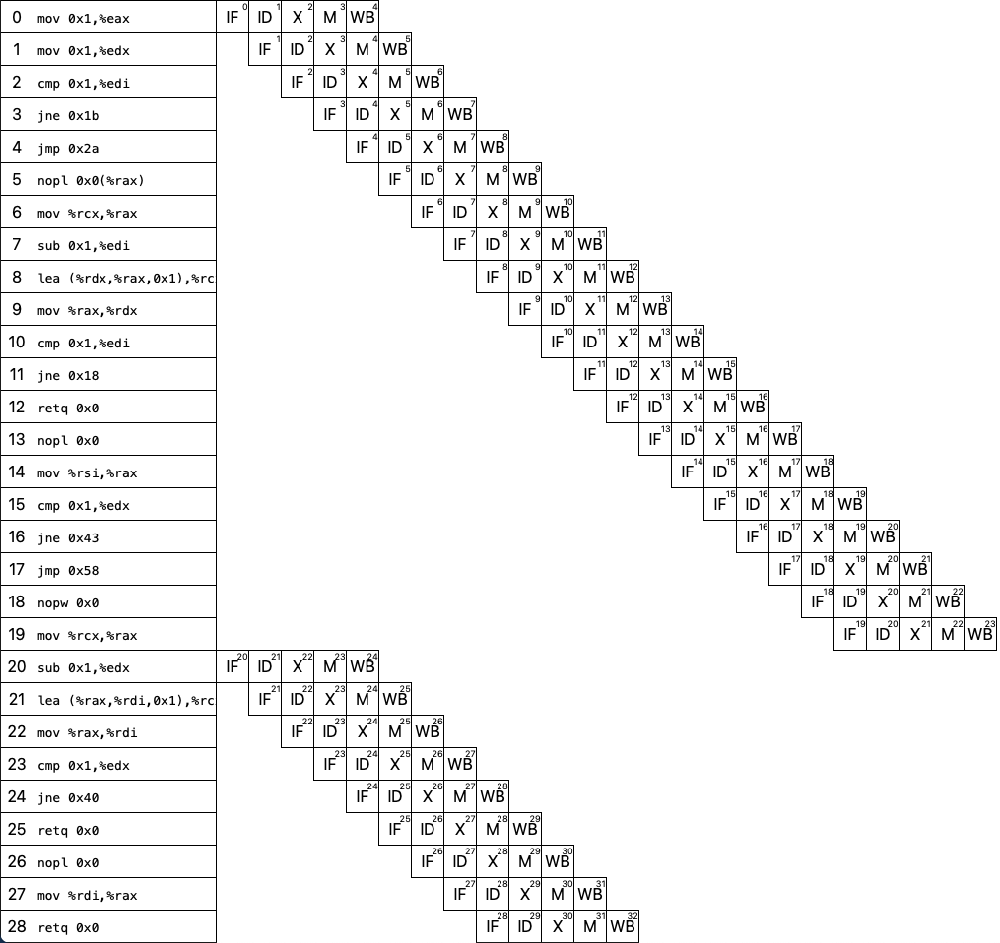

# Algorithmus

- [Fibonacci Folge](https://de.wikipedia.org/wiki/Fibonacci-Folge): $1,1,2,3,5,8,13,\ldots$

- $f: \mathbb{N} \to \mathbb{N},\; f(n) \mapsto \begin{cases} 1 & n < 2 \\ f(n - 1) + f(n - 2) & sonst\end{cases}$

- Laufzeit: $\mathcal{O}(2^n)$

# Performance

- Laufzeitbetrachtung unterschiedlicher Varianten
    - hängt von Implementierung ab (bei gleicher Spezifikation)

## Varianten

- Iterativ
    - ohne Caching
    - mit Caching
- Rekursiv
    - ohne Caching
    - mit Caching
    - Tailrecursive
- Loop unrolling

## Iterativ

\footnotesize
```{.c include=../src/fib_iterative.c startLine=4 endLine=100}
```
\normalsize

## Iterativ (Cache)

\footnotesize
```{.c include=../src/fib_iterative_cache.c startLine=4 endLine=100}
```
\normalsize

## Rekursiv

\footnotesize
```{.c include=../src/fib_rec.c startLine=3 endLine=100}
```
\normalsize

## Rekursiv (Cache)

\footnotesize
```{.c include=../src/fib_rec_cache.c startLine=6 endLine=100}
```
\normalsize

## Rekursiv (Tailrecursion)

\footnotesize
```{.c include=../src/fib_tailrec.c startLine=4 endLine=100}
```
\normalsize

## Loop unrolling

\footnotesize
```{.c include=../src/fib_unroll.c startLine=4 endLine=100}
```
\normalsize

## Charakteristik

Größe der Objektdateien

| Algorithmus | `-g`     | `-O3`    |
|-------------|---------:|---------:|
| Iterativ    |   3,6K   | 1,3K     |
| Iterativ C  |   4,2K   | 1,7K     |
| Rekursiv    |   3,5K   | 2,1K     |
| Rekursiv C  |   4,5K   | 1,4K     |
| Rekursiv T  |   3,8K   | 2,9K     |
| Rekursiv U  |   3,6K   | 1,3K     |

## Performance

- Vergleichen der Performance
- Erklären der Ursachen

## Laufzeit Maschine

- AMD Opteron(tm) Processor 6174
    - Freq: 2,2 GHz
    - Cores: 12
    - L1 Cache: 12 x 64 KB 2-way set associative caches
    - L2 Cache: 12 x 512 KB 16-way set associative exclusive caches
    - L3 Cache: 2 x 6 MB shared exclusive caches

## Laufzeit Werte

| Algorithmus | $n = 30$ | $n=10^4$ | $n=10^9$ | `-O3` $n=10^9$ |
|-------------|---------:|----------|---------:|---------------:|
| Iterativ    |   2,4ms  | 3,4ms    |   6,8s   | 1,72s          |
| Iterativ C  |   3,4ms  | 3,7ms    |   18s    | 7,436s         |
| Rekursiv    |   20ms   | -        |   -      | -              |
| Rekursiv C  |   1,5ms  | 4,7ms    |   -      | -              |
| Rekursiv T  |   1,5ms  | 4,4ms    |   -      | 1,74s          |
| Rekursiv U  |   3,4ms  | 3,2ms    |   2,3s   | 0,56s          |

## Warum ist `-O3` schneller als `-O0`?

- Variablen werden in Register gehalten (anstatt auf dem Stack)
    - Weniger Hauptspeicherzugriffe

## Debug Build (Iterativ)
\footnotesize
```{include=../build/debug/fib_iterative.objdump startLine=10 endLine=20 dedent=8}
```
\normalsize

## Release Build (Iterativ)
\footnotesize
```{include=../build/release/fib_iterative.objdump startLine=9 endLine=23 dedent=8}
```
\normalsize

## Warum ist die Cache Variante langsamer?

- Load/Store Befehle sind langsam(er)
- Algorithmus ist komplexer (mehr Befehle)

## Perf stat (Iterativ ohne Cache)
\footnotesize
```{include=../build/release/fib_iterative_1000000000.stat startLine=5 endLine=20 dedent=4}
```
\normalsize

## Perf stat (Iterativ mit Cache)
\footnotesize
```{include=../build/release/fib_iterative_cache_1000000000.stat startLine=5 endLine=20 dedent=4}
```
\normalsize

## Vergleich Iterativ mit Cache $\leftrightarrow$ Iterativ ohne Cache
Cache Variante hat:

- mehr context-siwtches (malloc, free)
- mehr page faults (weil Daten aus dem RAM gelesen werden)
- mehr Zyklen (durch Schreib-/ Lesevorgänge)
- mehr Instructions

## Perf stat (Tailrecursion)
\footnotesize
```{include=../build/release/fib_tailrec_1000000000.stat startLine=5 endLine=20 dedent=4}
```
\normalsize

## Vergleich Tailrecursion $\leftrightarrow$ Iterativ

Tailrec hat im Vergleich zu Iterative ähnliche:

- Laufzeit
- Context-Switches
- Page-Faults
- Zyklen
- Instructions
- Branches

$\rightarrow$ Compiler macht 'den selben' Code daraus

###
``To iterate is human, to recurse is divine''

\hfill - L Peter Deutsch

## Perf stat (Loop unrolling)
\footnotesize
```{include=../build/release/fib_unroll_1000000000.stat startLine=5 endLine=20 dedent=4}
```
\normalsize

## Vergleich Loop unrolling $\leftrightarrow$ Tailrecursion / Iterativ
Loop unrolling hat im Vergleich zu Tailrecursion / Iterative:

- bessere Laufzeit
- weniger Context-Switches
- weniger Zyklen (1/6)
- weniger Instructions (1/2)
- weniger Branches(!) (1/2)
- weniger Branch-Misses (1/4)

$\rightarrow$ ``Weniger Sprünge und mehr Rechenoperationen sind gut''

# Pipelining

- Tritt massiv auf
    - vor allem in optimierten Versionen (da weniger Speicherzugriffe)

## Iterative (Cache) `-g`



## Tailrecursion `-03`



## Superskalares Pipelining

- kann bei Iterationsschritt (`a = b, b = b + a, n += 1`) genutzt werden
    - Berechnungen können parallel stattfinden, wenn mehrere ALUs vorhanden sind

# Caching

- für alle Versionen relevant, besonders bei
    - Verwendung von explizitem Caches
    - Nutzung von Stackvariablen
- *Rückwärtsdurchlaufen* des Caches ungünstig (Rekurive Variante mit Cache)

###
\footnotesize
```{.c include=../src/fib_rec_cache.c startLine=21 endLine=26}
```
\normalsize

# Parallelität

- nicht effektiv nutzbar zur berechnung einer *einzelnen* Fibonacci Zahl
    - bei Nutzung von Cache drohen Data-Races
    - bei Iteration / Tailrecursion gibt es nur einen Pfad $\rightarrow$ keine Option zur Parallelisierung
    - (bei simpler rekursiver Variante theoretisch nutzbar)

# Fazit

- Fibonacci kann effektiv implementiert und ausgeführt werden
- Rechenlastige Algorithmus $\rightarrow$ effektiv ausführbar
- Explizites Caching nicht immer optimal

## Hyperlinks

Repository: https://github.com/herrmanno/C827-rechnerarchitektur

\begin{center}
% { .center width=400 }
\includegraphics[width=0.5\textwidth]{./qr-code.png}
\end{center}
